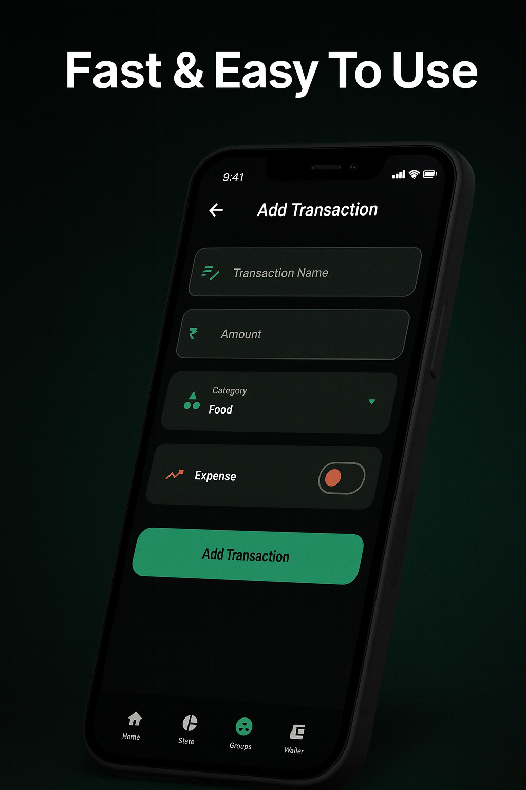
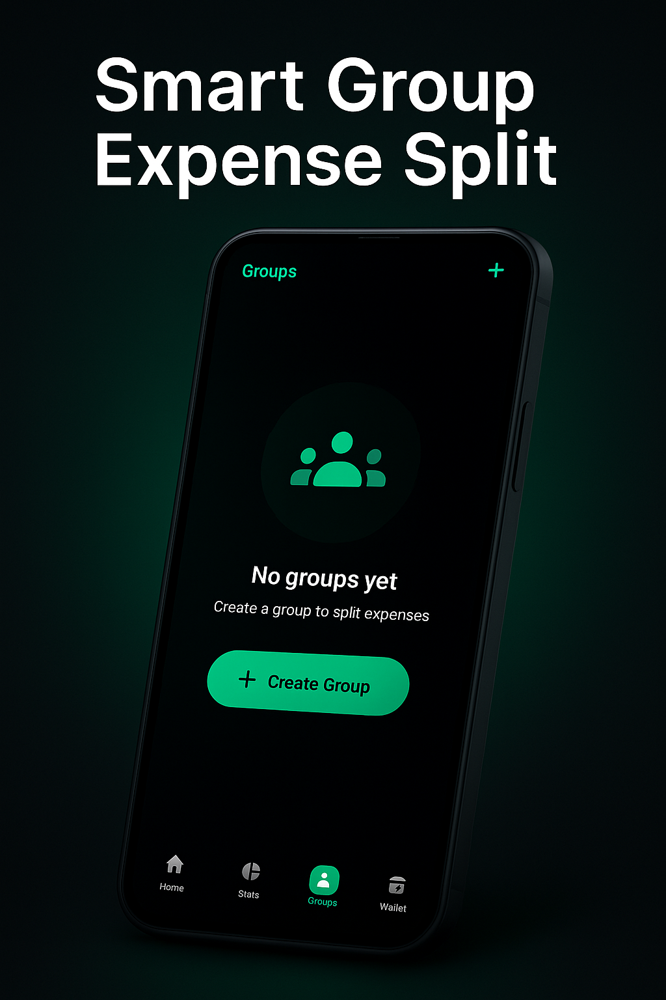
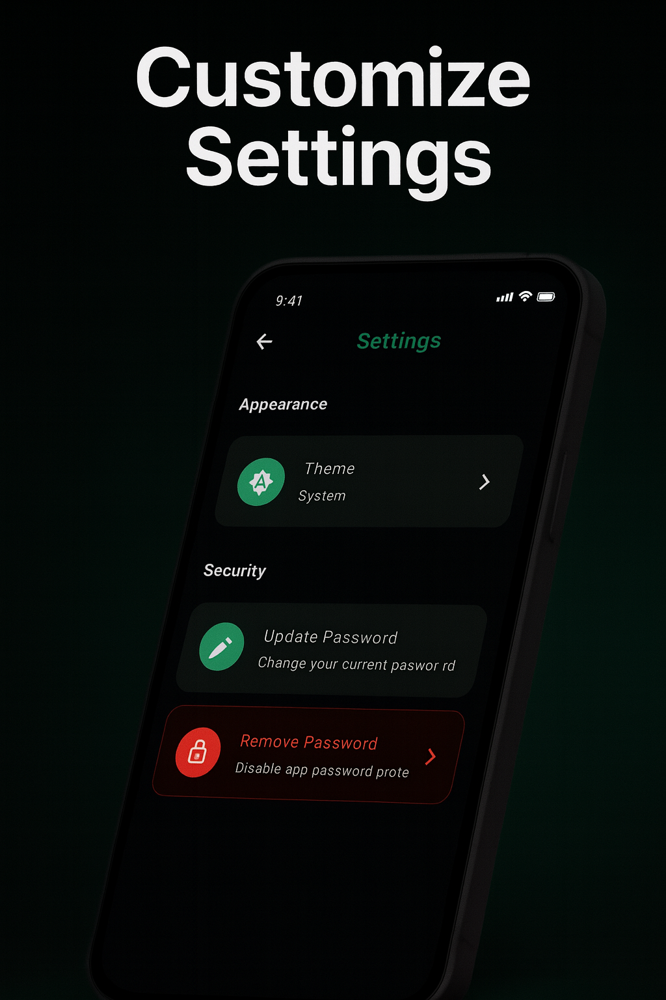
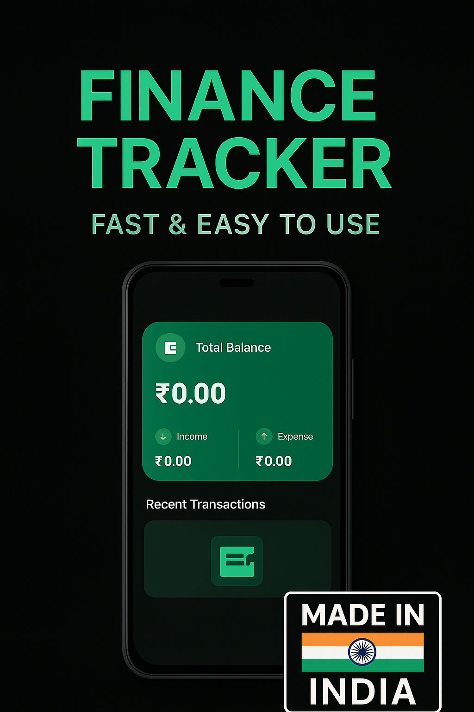
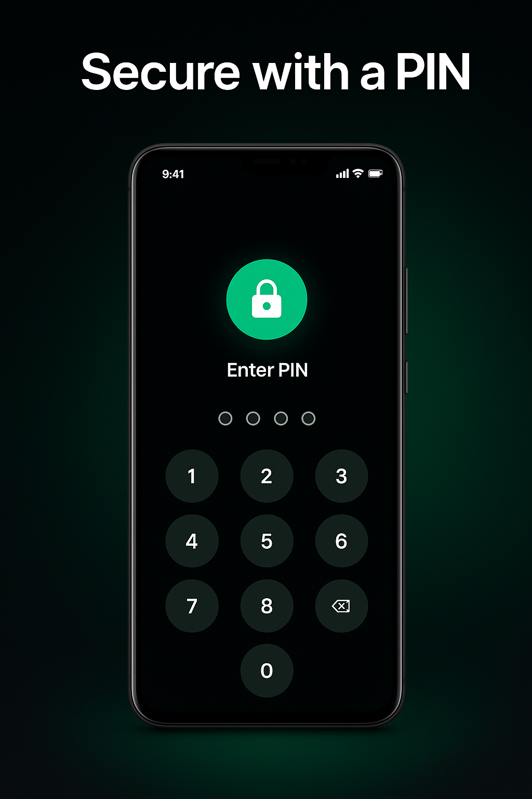
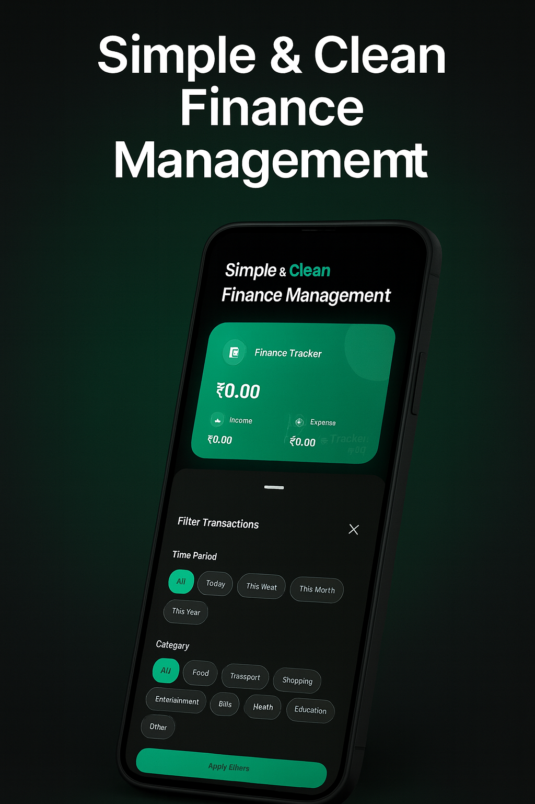
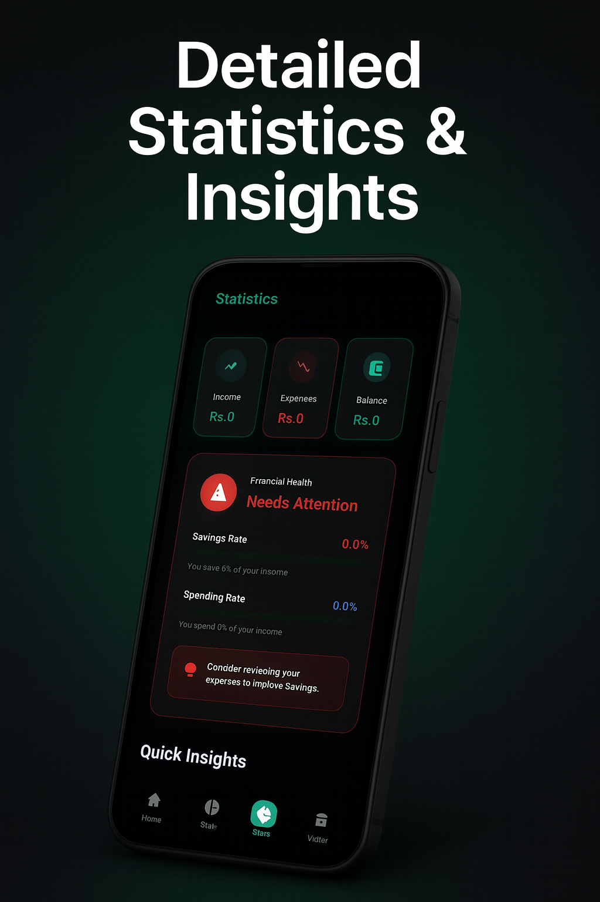

# 💎 Finance Tracker PRO

<div align="center">

  

  <br><br>

  <h1>Personal Finance, Reimagined.</h1>

  <p style="font-size: 1.1em; max-width: 600px;">
    <b>Track Expenses</b> • <b>Split Bills</b> • <b>Visual Analytics</b> • <b>Offline First</b>
  </p>

  <br>

  [](https://flutter.dev/)
  [](https://dart.dev/)
  [](LICENSE)
  <br>
  [](https://www.indusappstore.com/)
  [](releases/FinanceTracker.apk)
  [](INSERT_INDUS_APP_STORE_LINK_HERE)

  <br><br>

  <a href="https://github.com/abhishek0112cs221008/Finance-Tracker/issues">
    
  </a>
  <a href="https://github.com/abhishek0112cs221008/Finance-Tracker/issues">
    
  </a>

</div>

---

## 📖 Table of Contents

- [📍 Overview](#-overview)
- [✨ Key Features](#-key-features)
- [📱 Screenshots](#-screenshots)
- [🛠️ Tech Stack](#-tech-stack)
- [📦 Installation](#-installation)
- [🚀 Build & Release](#-build--release)
- [🔐 Privacy & Security](#-privacy--security)
- [🤝 Contributing](#-contributing)

---

## 📍 Overview

**Finance Tracker PRO** isn't just another expense manager. It's a comprehensive personal finance tool built with a focus on **User Experience** and **Data Privacy**. 

Designed with the latest **Material Design 3** principles, it offers a seamless, premium experience that makes managing money a pleasure rather than a chore. Whether you're tracking daily expenses, splitting trip costs with friends, or analyzing your monthly budget, Finance Tracker PRO handles it all with elegance and speed.

---

## ✨ Key Features

### 📊 **Smart Financial Tracking**
> *Log it, tag it, forget it.*
- ✅ **Fast Logging:** Add transactions in seconds with intuitive inputs.
- 🏷️ **Custom Categories:** Personalize your spending with icons and colors.
- 🔄 **Recurring Transactions:** Set it and forget it for bills & salaries.

### 📈 **Powerful Analytics**
> *See where your money goes.*
- 🎨 **Interactive Charts:** Beautiful Pie and Bar charts powered by `fl_chart`.
- 📅 **Monthly Reports:** Deep dive into spending habits by category or time.
- 🚀 **Trend Analysis:** Visualize your financial growth over time.

### 👥 **Group Expenses & Trip Splitting**
> *No more "Who owes who?"*
- 💸 **Split Bills:** Perfect for roommates, trips, and dinners.
- 🧮 **Simplify Debts:** Smart algorithm to minimize the number of transactions.
- ✈️ **Multiple Groups:** Manage different friend circles effortlessly.

### 🎨 **Premium Experience**
> *Finance, but make it beautiful.*
- 🎭 **8+ Themes:** Curated color palettes (Deep Teal, Midnight Green, etc.).
- 🌙 **Dark Mode:** True OLED black support for battery saving.
- 📱 **Edge-to-Edge UI:** Modern, immersive Material 3 design.

### 🔒 **Security & Tools**
- 🛡️ **PIN Lock:** Secure your data with 4-digit protection.
- 📄 **PDF Export:** Generate professional reports for sharing/printing.
- 💾 **Local Storage:** 100% Offline SQLite database. Your data, your rules.
- ₹ **Rupee Support:** Native currency handling designed for Indian users.

---

## 📱 Screenshots

<div align="center">
  
  
  
</div>
<br>
<div align="center">
  
  
  
</div>
<br>
<div align="center">
  
  
  
</div>

---

## 🛠️ Tech Stack

This project is built with love and code using:

| Category | Technology |
|----------|------------|
| **Framework** |  |
| **Language** |  |
| **State Management** | **Provider** (Simple, Efficient, Scalable) |
| **Database** | **SQLite** (`sqflite`) - Robust offline storage |
| **Visualization** | **FL Chart** - High-performance chart rendering |
| **PDF Generation** | **Printing & PDF** - Document creation |

---

## 📦 Installation

🚀 **Want to try it out instantly?**  
👉 [**Download Latest APK**](releases/FinanceTracker.apk)

Or get the project running on your local machine:

1.  **Clone the Repo**
    ```bash
    git clone https://github.com/abhishek0112cs221008/Finance-Tracker.git
    cd Finance-Tracker
    ```

2.  **Install Dependencies**
    ```bash
    flutter pub get
    ```

3.  **Run the App**
    ```bash
    flutter run
    ```

---

## 🚀 Build & Release

To build a **signed release APK** for Android:

```bash
flutter build apk --release
```

**Output:** `build/app/outputs/flutter-apk/app-release.apk`

---

## 🔐 Privacy & Security

Your data is **YOURS**.
- No external servers 🚫
- No cloud syncing (unless user initiated backup) ☁️
- All data stored locally on your device 📱

---

## 🤝 Contributing

Contributions are what make the open source community such an amazing place to learn, inspire, and create. Any contributions you make are **greatly appreciated**.

1. Fork the Project
2. Create your Feature Branch (`git checkout -b feature/AmazingFeature`)
3. Commit your Changes (`git commit -m 'Add some AmazingFeature'`)
4. Push to the Branch (`git push origin feature/AmazingFeature`)
5. Open a Pull Request

---

<div align="center">
  <br>
  
  <h3>Developed with ❤️ by <a href="https://github.com/abhishek0112cs221008">Abhishek</a></h3>
  
  <p>
    <a href="https://github.com/abhishek0112cs221008">
      
    </a>
    &nbsp;&nbsp;
    <a href="mailto:abhishek@example.com">
      
    </a>
  </p>

  <br>
</div>
